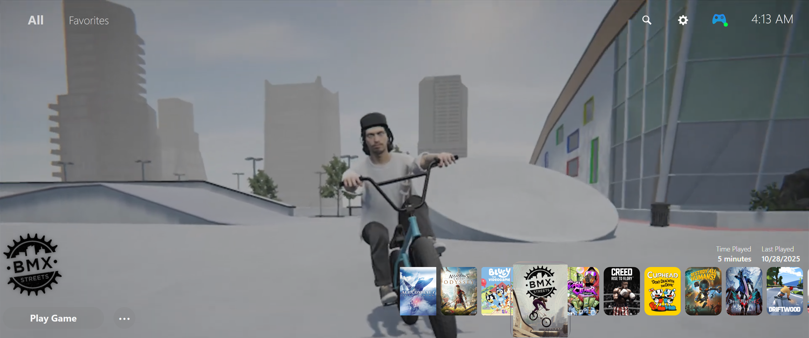
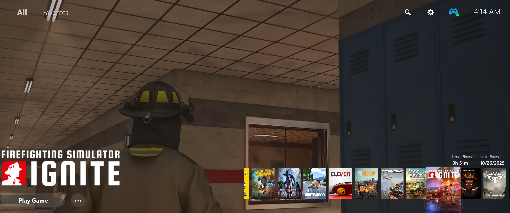

# TrailerLovers
Fullscreen Theme for Playnite

__________________________________________________________________________

Recommended settings:

tested on 1920x1080

Activate horizontal scrolling.
columns: 10. 
space between elements: 37. 

Before you begin, make sure to have the following Add-on installed for an optimal theme experience.

To download them, go to settings by clicking on the Playnite icon shaped like a controller, located at the top left. Then, select "Add-on" and go to the "Browse" tab at the bottom to search for the extensions.

Recommended extensions:

	Generic:

    		ExtraMetadataLoader
    		ExtraMetadataLoader Fullscreen Helper
    		How Long To Beat
    		SuccessStory
    		Splash Screen (optional)
    		PlayniteSound (optional)

	Metadata Source:

   		Universal PSN Metadata

___________________________________________________________________________

I hope you enjoy your experience
