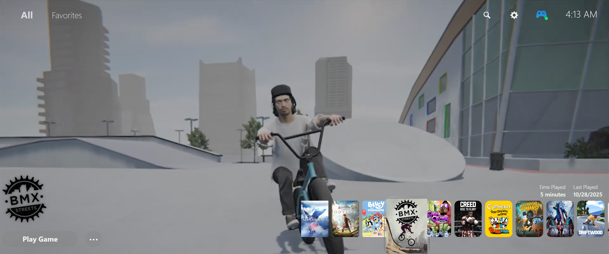
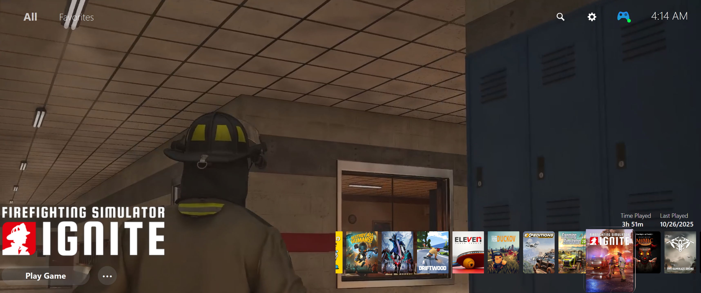

# TrailerLovers-NoPSN

A beautiful fullscreen theme for Playnite, personally modified and enhanced for the ultimate gaming experience.

[](https://github.com/DreadHeadHippy/TrailerLovers-NoPSN/releases/latest)
[](LICENSE)

## Screenshots





## ✨ Features

- **Optimized for Modern Displays**: Perfect for 1920x1080 and ultrawide 3440x1440 (21:9) resolutions
- **Enhanced Visual Experience**: Carefully crafted UI elements with smooth animations
- **Comprehensive Game Information**: Displays all essential game metadata beautifully
- **Extension Support**: Seamlessly integrates with popular Playnite extensions

## 🚀 Quick Install

### Option 1: Direct Download (Recommended)
1. Go to the [Releases](https://github.com/DreadHeadHippy/TrailerLovers-NoPSN/releases) page
2. Download the latest `.pthm` file
3. Double-click the file to install automatically in Playnite

### Option 2: Manual Install
1. Download and extract the theme files
2. Copy to your Playnite themes folder: `%AppData%\Playnite\Themes\Fullscreen\`
3. Restart Playnite and select the theme

## ⚙️ Recommended Settings

For the best experience, configure Playnite with these settings:

- **View Type**: Grid view with horizontal scrolling enabled
- **Grid Columns**: 10 columns
- **Spacing**: 37 pixels between elements

## 🔌 Required Extensions

Install these extensions for the complete experience:

### Essential Extensions
- **ExtraMetadataLoader** - Enhanced game metadata
- **ExtraMetadataLoader Fullscreen Helper** - Fullscreen integration
- **How Long To Beat** - Game completion times
- **SuccessStory** - Achievement tracking

### Optional Extensions
- **Splash Screen** - Custom loading screens
- **PlayniteSound** - Audio enhancements

**Installation:** Go to Playnite Settings → Add-ons → Browse tab to install extensions.

## 🛠️ Development

This theme is based on the original TrailerLovers theme by blooderscrew, with personal modifications and enhancements.

### Building from Source
```bash
# Clone the repository
git clone https://github.com/DreadHeadHippy/TrailerLovers-NoPSN.git

# Create package
./scripts/build-release.ps1
```

## 📝 Changelog

See [CHANGELOG.md](CHANGELOG.md) for detailed version history.

## 🤝 Contributing

Contributions are welcome! Please feel free to submit pull requests or open issues for suggestions and bug reports.

## 📄 License

This project is licensed under the MIT License - see the [LICENSE](LICENSE) file for details.

## 🙏 Acknowledgments

- Original theme by [blooderscrew](https://github.com/blooderscrew1/TrailerLovers)
- Playnite community for feedback and testing

---

⭐ If you enjoy this theme, please give it a star on GitHub!
